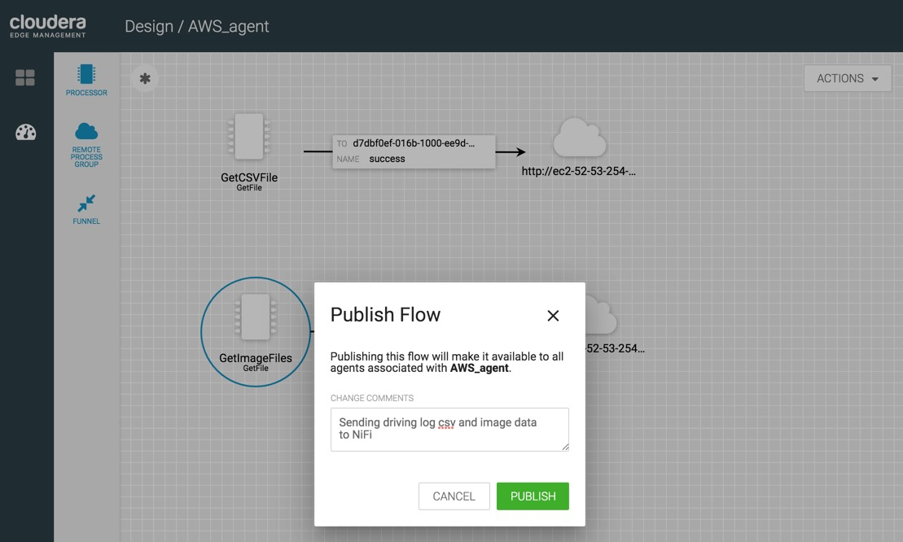
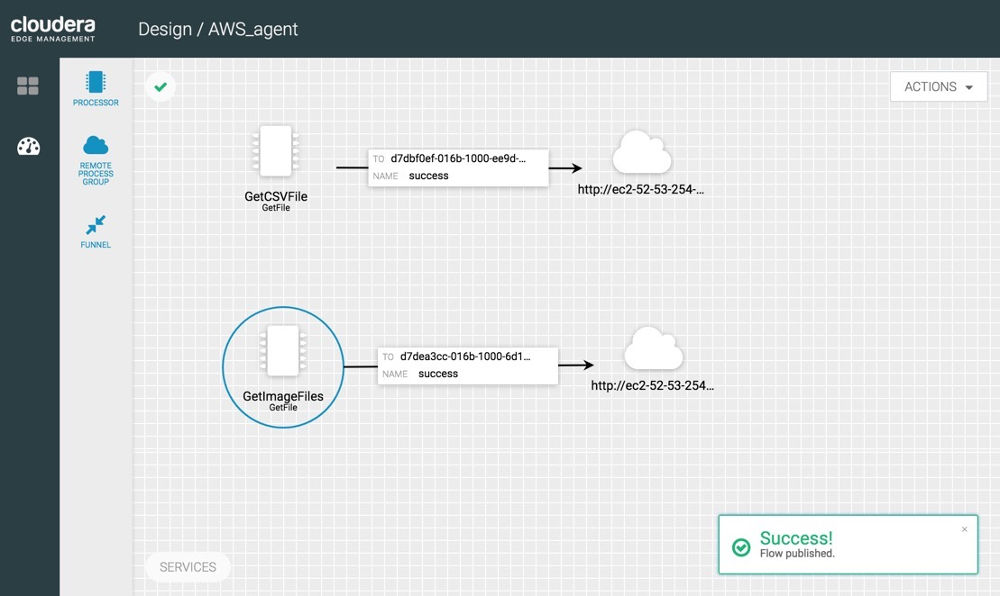
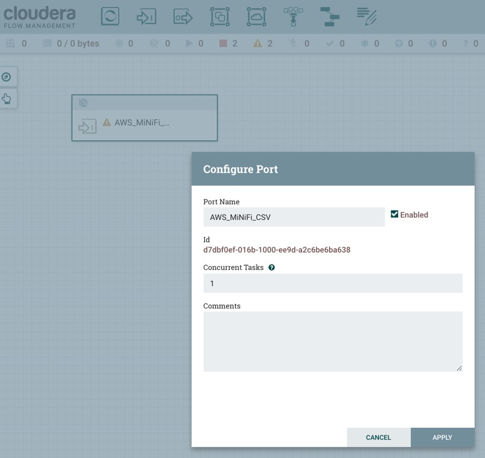
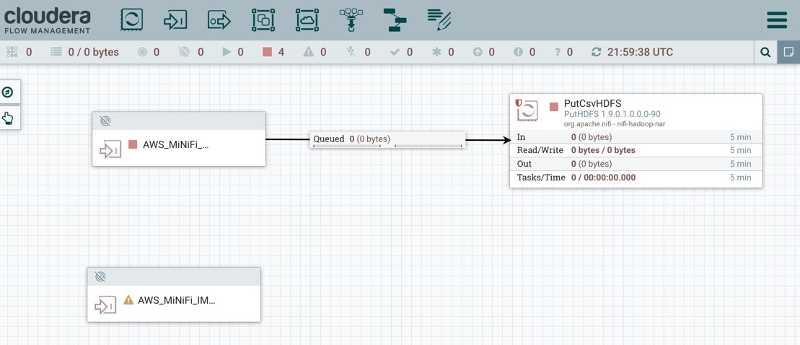
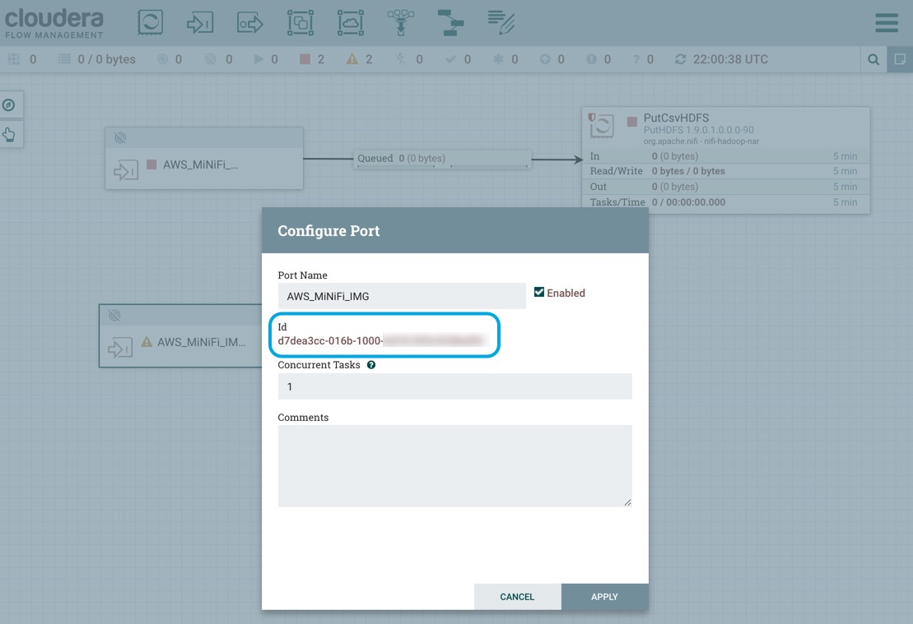
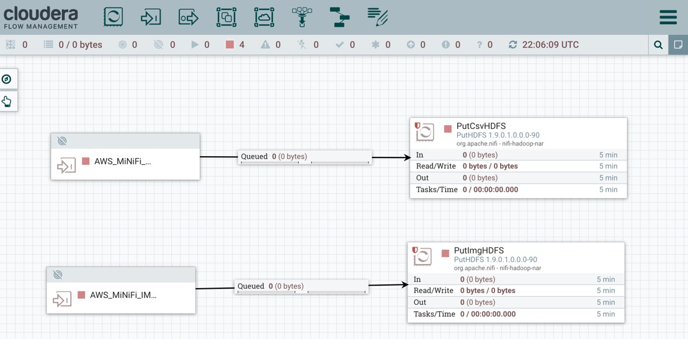
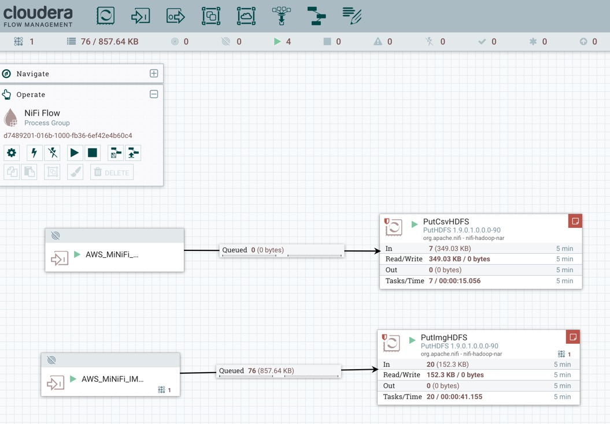
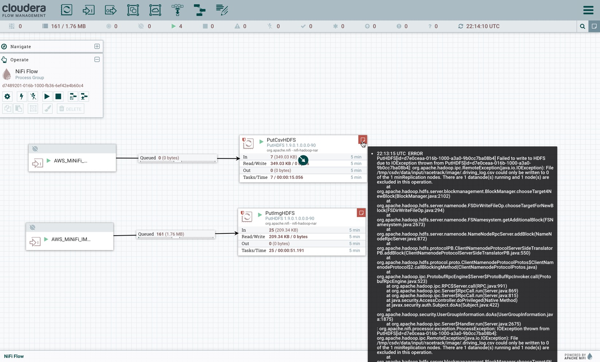
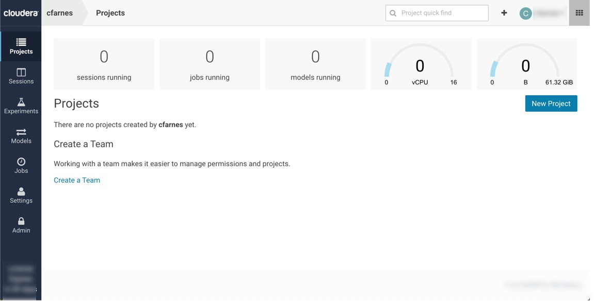
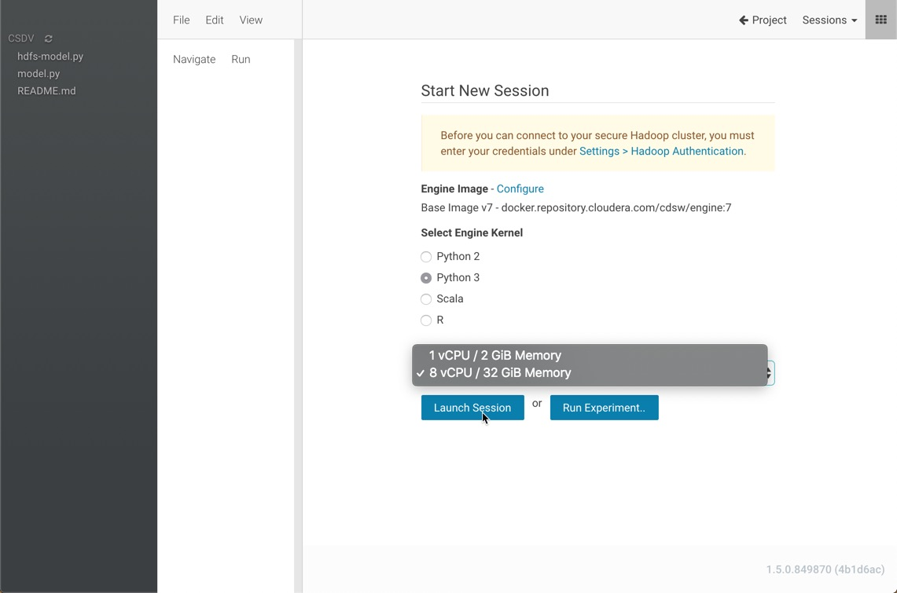

# Autonomous Car

## Intro

Autonomous Car is the Open Source version of Cloudera Self Driving Vehicle. This Driverless miniature car powered by 3D Camera, LiDAR and Game Controller connected to the Jetson TX2 Board. ROS runs on the TX2 and controls the car's movement. Keras can run on the TX2 or run on CDSW in the cloud. Training the CNN can be done on the car or in the cloud. Eventually if we have multiple cars, we could train the model on the car, then send that model to CDSW and perform federated learning. In this tutorial, we send the car data to the Hadoop HDFS in the cloud. We use CDSW to run Keras to train the model, then save the model to HDFS. The model is trained on cloning a person's driving behavior from a racetrack. The model once deployed on the car is able to predict steering angle based on center camera frames, which controls the car using ROS. Once a constant speed is passed to ROS and steering prediction is occuring, we have a driving autonomusly on our track.

In this tutorial, you will build an Edge to AI application featuring CDF and CDSW.

## Big Data Technologies used to develop the Application:

- Nvidia Jetson TX2
    - Apache MiNiFi C++ Agent
- CDF
    - CEM: Interactive UI for building MiNiFi dataflows
    - CFM: Apache NiFi
- CDH
    - Apache Hadoop - HDFS
    - CDSW: IDE for Machine Learning

## Learning Objectives

- Install MiNiFi C++ Agent onto Jetson TX2
- Understand the car sensor data from TX2
- Build a ETL Data Pipeline for data ingest with CEM for MiNiFi
- Connect MiNiFi Data Pipeline to NiFi Data Pipeline
- Connect NiFi Pipeline to Hadoop HDFS
- Mine for HDFS data in CDSW
- Train Keras CNN model in CDSW
- Save model.h5 in HDFS
- Build a NiFi Pipeline to pull in HDFS model.h5
- Send model from NiFi to MiNiFi
- Deploy model using MiNiFi

## Bill of Materials

- [Nvidia Jetson TX2 Development Kit](https://www.amazon.com/NVIDIA-945-82771-0000-000-Jetson-TX2-Development/dp/B06XPFH939)
- [Racecar/J Robot Base Kit](https://racecarj.com/products/racecar-j-robot-base-kit)

## Prerequisites

- Deployed MiNiFi C++ agent on AWS EC2 Ubuntu 18.04 instance or Jetson TX2
    - AWS: t2.micro
- Deployed CEM on AWS EC2 instance
    - AWS: CentOS7 - with Updates HVM, t3.2xlarge, All traffic - all protocol - all ports - my IP
- Deployed CDH with CDSW enabled on AWS EC2 instance
    - Add private and public DNS of CEM EC2

## Outline

- Tutorial 0: Install MiNiFi C++ on Edge
- Tutorial 1: Ingest Car Sensor Data on Edge
- Tutorial 2: Collect Car Edge Data into Cloud
- Tutorial 3: Train CNN Model in Cloud
- Tutorial 4: Deploy CNN Model onto Car

## Tutorial 0: Install MiNiFi C++ on Edge

### Option 1: Jetson TX2

### Option2: EC2 Instance

SSH on to the machine assigned to be the agent:

~~~bash
ssh -i /path/to/pem_file <os-name>@<public-dns-ipv4>
~~~

Install MiNiFi C++:

~~~bash
# MiNiFi C++ for Ubuntu 18.04
wget http://mirrors.ibiblio.org/apache/nifi/nifi-minifi-cpp/0.6.0/nifi-minifi-cpp-bionic-0.6.0-bin.tar.gz

tar -xvf nifi-minifi-cpp-bionic-0.6.0-bin.tar.gz
~~~

Open your local terminal, we will transport updated minifi.properties file from our local machine to the ec2 instance:

~~~bash
wget -O ~/Downloads/minifi.properties https://raw.githubusercontent.com/james94/Autonomous-Car/master/documentation/assets/services/minifi_cpp/minifi.properties
scp -i ~/.ssh/jmedel-aws-iam.pem ~/Downloads/minifi.properties ubuntu@<ec2-public-dns>:/home/ubuntu/nifi-minifi-cpp-0.6.0/conf
~~~

Open your ec2 instance terminal:

~~~bash
vi $HOME/nifi-minifi-cpp-0.6.0/conf/minifi.properties
~~~

Enter your public host name in these fields

~~~bash
nifi.c2.agent.coap.host=<CEM Public DNS>

nifi.c2.flow.base.url=<CEM Public DNS>:10080/efm/api

nifi.c2.rest.url=<CEM Public DNS>:10080/efm/api/c2-protocol/heartbeat

nifi.c2.rest.url.ack=<CEM Public DNS>:10080/efm/api/c2-protocol/acknowledge
~~~

Download sample driving log data for MiNiFi:

~~~bash
sudo apt -y install unzip
mkdir -p /tmp/csdv/data/input/racetrack/
cd /tmp/csdv/data/input/racetrack/
wget https://github.com/james94/Autonomous-Car/raw/master/documentation/assets/data/image.tar.gz
tar -xvf image.tar.gz
~~~

Turn on agent:

~~~
cd nifi-minifi-cpp-0.6.0/bin
./minifi.sh start
~~~

## Tutorial 1: Ingest Car Sensor Data on Edge

We will use Cloudera Edge Manager (CEM) to build a MiNiFi dataflow in the interactive UI and publish it to the MiNiFi agent running on the edge. This dataflow will ingest the car sensor data coming from ROS and push it to NiFi running in the cloud.

- Cloudera Edge Manager runs on port: `10080/efm/ui`

`<cem-ec2-public-dns>:10080/efm/ui`

### Build Data Flow for MiNiFi via CEM UI

The CEM events page will open:

Click on Flow Designer, you can click on the class associated with MiNiFi agent you want to build the dataflow for. 

> Note: Later when MiNiFi C++ agent deployed on separate the Jetson TX2, the class called **"CSDV_agent"** will appear.

For now click class **AWS_agent**. Press open to start building. The canvas opens for building flow for class **AWS_agent**:

We will build a MiNiFi ETL pipeline to ingest csv and image data.

### Add a GetFile for CSV Data Ingest

Add a **GetFile** processor onto canvas to get csv data:

Update processor name to **GetCSVFile**.

Double click on GetFile to configure. Scroll to **Properties**, add the properties in Table 1 to update GetFile's properties.

**Table 1:** Update **GetCSVFile** Properties

| Property  | Value  |
|:---|---:|
| `Input Directory`  | `/tmp/csdv/data/input/racetrack/image`  |
| `Keep Source File`  | `false`  |
| `Recurse Subdirectories` | `false` |

### Push CSV Data to Remote NiFi Instance

Add a **Remote Process Group** onto canvas to send csv data to NiFi remote instance:

Add URL NiFi is running on:

| Settings  | Value  |
|:---|---:|
| `URL` | `http://<ec2-public-DNS>:8080/nifi/` | 

Connect **GetCSVFile** to Remote Process Group, then add the NiFi destination input port ID you want to send the csv data:

| Settings  | Value  |
|:---|---:|
| `Destination Input Port ID` | `<NiFi-input-port-ID>` | 

> Note: you can find the input port ID by clicking on your input port in the NiFi flow. Make sure you connect to the input port that sends csv data to HDFS.

### Add a GetFile for Image Data Ingest

Add a **GetFile** processor onto canvas to get image data:

Update processor name to **GetImageFiles**.

Double click on GetFile to configure. Scroll to **Properties**, add the properties in Table 2 to update GetFile's properties.

**Table 2:** Update **GetFile** Properties

| Property  | Value  |
|:---|---:|
| `Input Directory`  | `/tmp/csdv/data/input/racetrack/image/logitech`  |
| `Keep Source File`  | `false`  |

### Push Image Data to Remote NiFi Instance

Add a **Remote Process Group** onto canvas to send image data to NiFi remote instance:

| Settings  | Value  |
|:---|---:|
| `URL` | `http://<ec2-public-DNS>:8080/nifi/` | 

Connect **GetImageFiles** to Remote Process Group, then add the following configuration:

| Settings  | Value  |
|:---|---:|
| `Destination Input Port ID` | `<NiFi-input-port-ID>` | 

> Note: you can find the input port ID by clicking on your input port in the NiFi flow. Make sure you connect to the input port that sends image data to HDFS.

### Publish Data Flow to MiNiFi Agent

Click on publish in actions dropdown:

Make this flow available to all agents associated with **AWS_agent** class, press publish:

> Note: you can add comment `Sending driving log csv and image data to NiFi`

Result of published successful:

## Tutorial 2: Collect Car Edge Data into Cloud

We will use Cloudera Flow Manager (CFM) to build a NiFi dataflow in the interactive UI running in the cloud on an aws ec2 instance. This dataflow will be used to extract data from the MiNiFi agent, transform the data for routing csv and image data to HDFS running on another ec2 instance.

- Cloudera Flow Manager runs on port: `8080/nifi/`

`<cfm-ec2-public-dns>:8080/nifi/`

### Upload Hadoop HDFS Location to NiFi

SSH into EC2 instance running NiFi:

~~~
ssh -i /path/to/pem_file <os-name>@<public-dns-ipv4>
~~~

~~~bash
# download hdfs core-site.xml
mkdir -p /tmp/service/hdfs/
cd /tmp/service/hdfs/
wget https://raw.githubusercontent.com/james94/Autonomous-Car/master/documentation/assets/services/hadoop_hdfs/core-site.xml
~~~

Enter your CDH public host name in these field of core-site.xml:

~~~xml
  <property>
    <name>fs.defaultFS</name>
    <value>hdfs://{CDH Public DNS}:8020</value>
  </property>
~~~

Save core-site.xml.

### Build NiFi Flow to Load Data into HDFS

### Add Input Port for CSV Data Ingest from MiNiFi Agent

Add an **input port** to extract csv data from MiNiFi:

Update input port name to **AWS_MiNiFi_CSV**.

Take note of **input port ID** under port details since we will need it for CEM UI.

### Save CSV Input Port ID for MiNiFi CEM Flow

> Note: if you haven't added inport port id for csv data in your minifi flow, take this id above to your minifi flow.

### Connect and Load CSV to HDFS

Add a **PutHDFS** processor onto canvas to store driving log data. Update processor name to **PutCsvHDFS**.

Update the following processor properties:

| Property  | Value  |
|:---|---:|
| `Hadoop Configuration Resources` | `/tmp/service/hdfs/core-site.xml` |
| `Directory`  | `/tmp/csdv/data/input/racetrack/image/`  |

Connect the **AWS_MiNiFi_CSV** input port to **PutCsvHDFS** processor:

### Add Input Port for Image Data Ingest from MiNiFi Agent

Add an **input port** to extract image data from MiNiFi:

Update input port name to **AWS_MiNiFi_IMG**.

Take note of **input port ID** under port details since we will need it for CEM UI.

### Save Image Input Port ID for MiNiFi CEM Flow

> Note: if you haven't added inport port id for image data in your minifi flow, take this id above to your minifi flow.

### Connect and Load Images to HDFS

Add a **PutHDFS** processor onto canvas to store driving log data. Update processor name to **PutImgHDFS**.

Update the following processor scheduling:

| Scheduling  | Value  |
|:---|---:|
| `Concurrent Tasks` | `5` |

Update the following processor properties:

| Property  | Value  |
|:---|---:|
| `Hadoop Configuration Resources` | `/tmp/service/hdfs/core-site.xml` |
| `Directory`  | `/tmp/csdv/data/input/racetrack/image/logitech`  |

Connect the **AWS_MiNiFi_IMG** input port to **PutImgHDFS** processor:

### Start NiFi Flow

Highlight all components on NiFi canvas with `ctrl+A` or `cmd+A`, then in the operate panel, press the start button:

You should see data flowing from NiFi to HDFS as above.

> Note: if you don't see data flowing, go back to the CEM UI, make sure you have your flow connected to this NiFi remote instance. Also make sure MiNiFi Agent is runnining.

Potential error you may see can be ignored:

## Tutorial 3: Train CNN Model in Cloud

We will use Cloudera Distribution Hadoop (CDH) to have access car data in Hadoop - HDFS for when we work in Cloudera Data Science Workbench (CDSW) and train the Keras CNN model. This access to HDFS will also allow us to save the model into HDFS from CDSW. CDSW will be running on the same ec2 instance as CDH and HDFS, but in a docker container.

- Cloudera Data Science Workbench runs at web address:

 `http://cdsw.<cdh-ec2-public-dns>.nip.io`

Sign in to CDSW and select new project and name it CSDV

then select a local folder and upload the CSDV project you downloaded earlier:

Once the folder uploads to CDSW, open a new workbench:

when selecting to open a new workbench ensure that you have an engine configuration with at least 20Gb of RAM or a GPU with 8GB of RAM and Python3

when you start the session click on the read me file and ensure the packages listed there are running in your CDSW engine

now we can begin training our model, select the `hdfs-model.py` file on the CDSW file explorer, but before we can run the training script we must ensure that there is data flowing in to HDFS from our CEM cluster

enter the following command on the workbench:

`!hdfs dfs -ls /tmp/csdv/data/input/racetrack/image/logitech`

the output should show a few files stored into HDFS. However, if not all of the files you intended to send over are stored into HDFS yet, you should wait because the more data we have the better the model will be.

## Tutorial 4: Deploy Keras Model to Edge

With the model saved in HDFS, we will use NiFi to pull in the model to the dataflow, so it can be transported to the MiNiFi agent running on the edge.

- Jetson TX2 runs at static IP address: `<tx2-static-ip>`

You will need to setup a static IP address.

