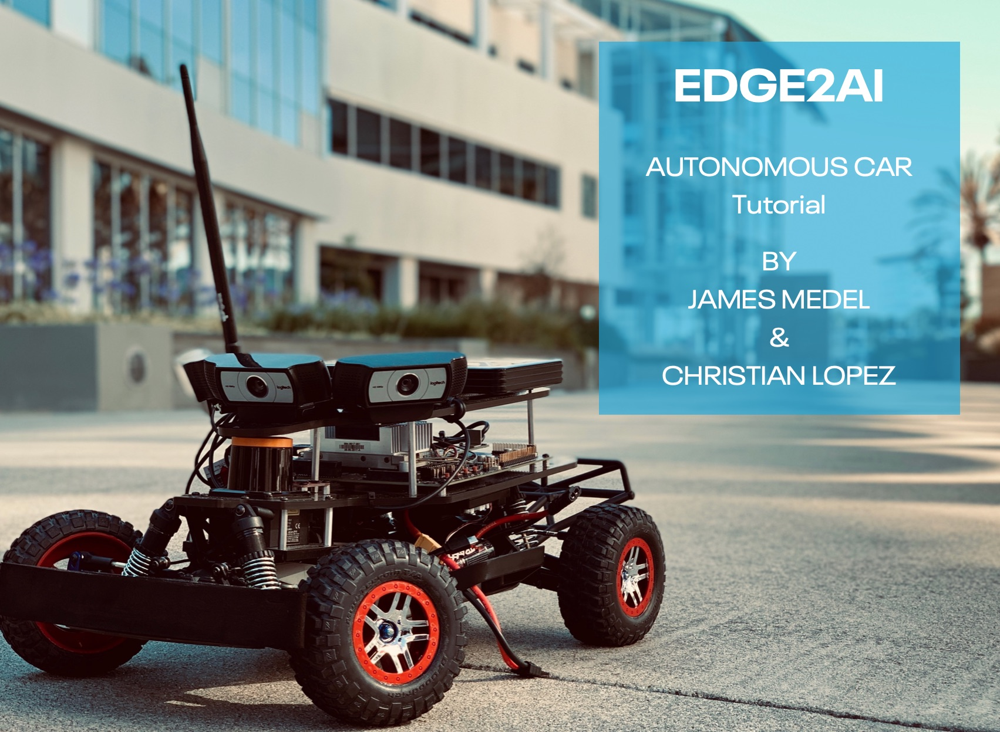

# Autonomous Car Tutorial

## Intro

Autonomous Car is the Open Source version of Cloudera Self Driving Vehicle. This Driverless miniature car powered by 3 cameras, LiDAR and game controller connected to the Jetson TX2 Board. TX2 runs Robot Operating System (ROS) and controls the car's movement. Eventually, if we have multiple cars, we could train the model on the car, then send that model to CDSW and perform federated learning. In this tutorial, we send the car data to the Hadoop HDFS in the cloud. We use CDSW to run Keras to train the model, then save the model to HDFS. The model is trained on cloning a person's driving behavior from a racetrack to predict steering angle based on center camera frames, which controls the car using ROS. Finally, the model is deployed back into the car with the purpose of illustrating the Edge To AI life cycle.

## Learning Objectives

- Build a ETL Data Pipeline for data ingest with CEM for MiNiFi
- Connect MiNiFi Data Pipeline to NiFi Data Pipeline
- Connect NiFi Pipeline to Hadoop HDFS
- Mine for HDFS data in CDSW
- Train Keras CNN model in CDSW
- Save to HDFS
- Build a NiFi Pipeline to pull in HDFS model.h5
- Send model from NiFi to MiNiFi

## Outline

- [Tutorial 2: Ingest Car Sensor Data on Edge](https://github.com/Chaffelson/Autonomous-Car/blob/master/tutorial-2.md)
- [Tutorial 3: Collect Car Edge Data into Cloud](https://github.com/Chaffelson/Autonomous-Car/blob/master/tutorial-3.md)
- [Tutorial 4: AI to Edge](https://github.com/Chaffelson/Autonomous-Car/blob/master/tutorial-4.md)

## The following objectives require expensive hardware

- Install MiNiFi C++ Agent onto Jetson TX2
- Understand the car sensor data from TX2
- (Current Steps Above)
- Deploy model using MiNiFi