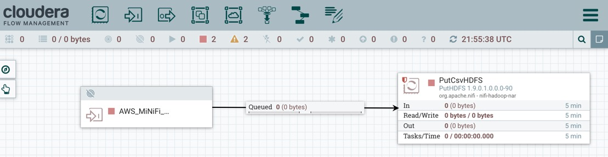
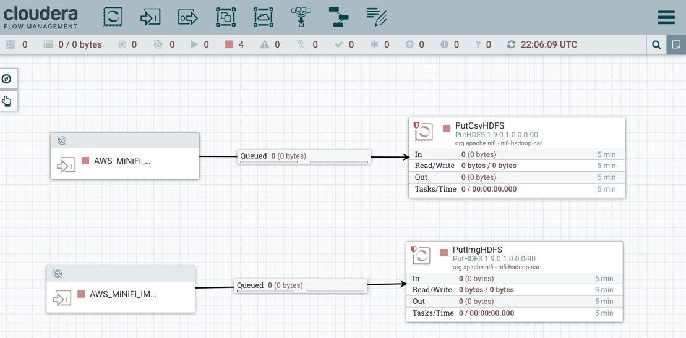
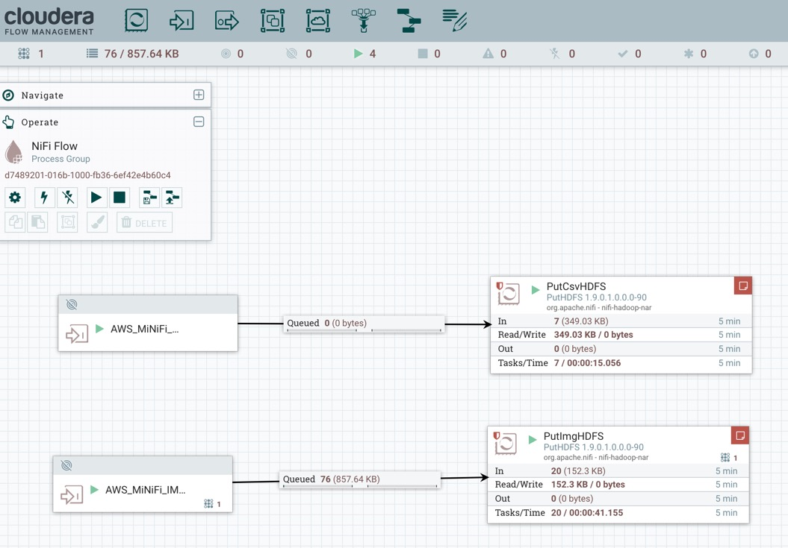
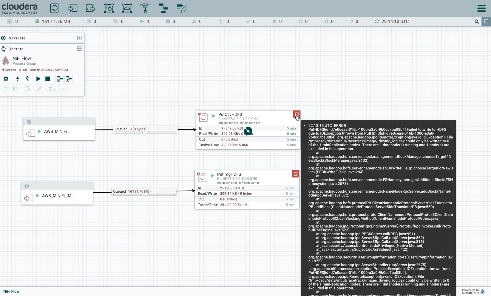

# Tutorial 2: Collect Car Edge Data into Cloud

We will use Cloudera Flow Manager (CFM) to build a NiFi dataflow in the interactive UI running in the cloud on an aws ec2 instance. This dataflow will be used to extract data from the MiNiFi agent, transform the data for routing csv and image data to HDFS running on another ec2 instance.

- Cloudera Flow Manager runs on port: `8080/nifi/`

`<cfm-ec2-public-dns>:8080/nifi/`

## Build NiFi Flow to Load Data into HDFS

### Connect and Load CSV to HDFS

Add a **PutHDFS** processor onto canvas to store driving log data. 

In Settings, Update processor name to **PutCsvHDFS**.

In Settings, Set AutoTerminate for **Success** and **Failure** relationships.

Update the following processor Properties:

**Table 5:** Update **PutCsvHDFS** Properties

| Property  | Value  |
|:---|---:|
| `Hadoop Configuration Resources` | `/etc/hadoop/conf.cloudera.hdfs/core-site.xml` |
| `Directory`  | `/tmp/data/input/racetrack/image/`  |
| `Conflict Resolution Strategy`  |  `Replace`  |

Connect the **AWS_MiNiFi_CSV** input port to **PutCsvHDFS** processor:

### Connect and Load Images to HDFS

Add a **PutHDFS** processor onto canvas to store driving log data.

In Settings, Update processor name to **PutImgHDFS**.

In Settings, Set AutoTerminate for **Success** and **Failure** relationships.

**Table 6:** Update the following processor properties:

| Property  | Value  |
|:---|---:|
| `Hadoop Configuration Resources` | `/etc/hadoop/conf.cloudera.hdfs/core-site.xml` |
| `Directory`  | `/tmp/data/input/racetrack/image/logitech`  |
| `Conflict Resolution Strategy`  |  `Replace`  |

Connect the **AWS_MiNiFi_IMG** input port to **PutImgHDFS** processor:

### Start NiFi Flow

Highlight all components on NiFi canvas with `ctrl+A` or `cmd+A`, then in the operate panel, press the start button:

You should see data flowing from NiFi to HDFS as above.

> Note: if you don't see data flowing, go back to the CEM UI, make sure you have your flow connected to this NiFi remote instance. Also make sure MiNiFi Agent is runnining.
Potential error you may see cannot be ignored, it most likely means you have the wrong core-site.xml. You should make sure if you need to do a search for core-site.xml on CDH that it comes from the client, example cdsw-client, and the following error should go away for PutHDFS:

