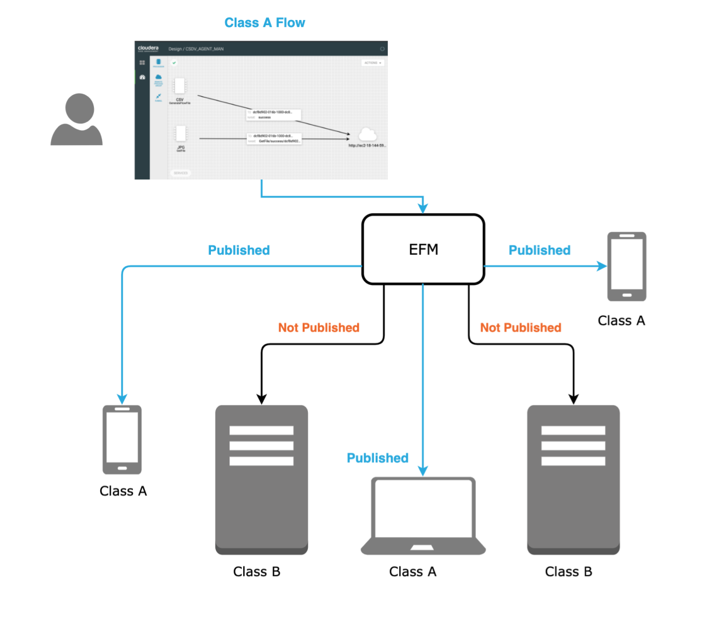
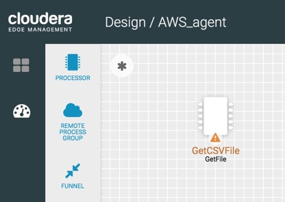
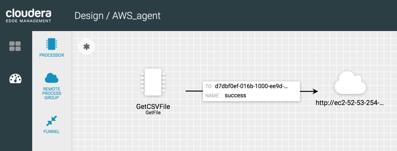
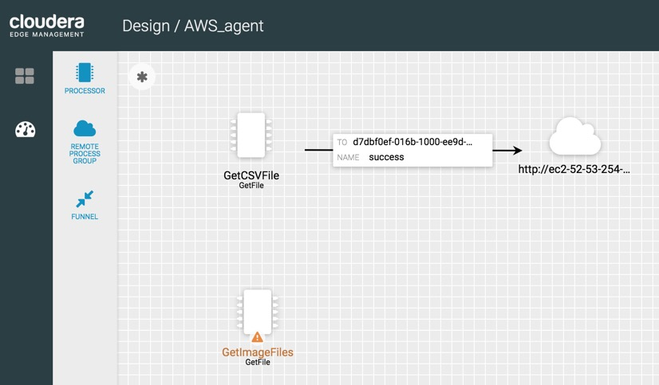
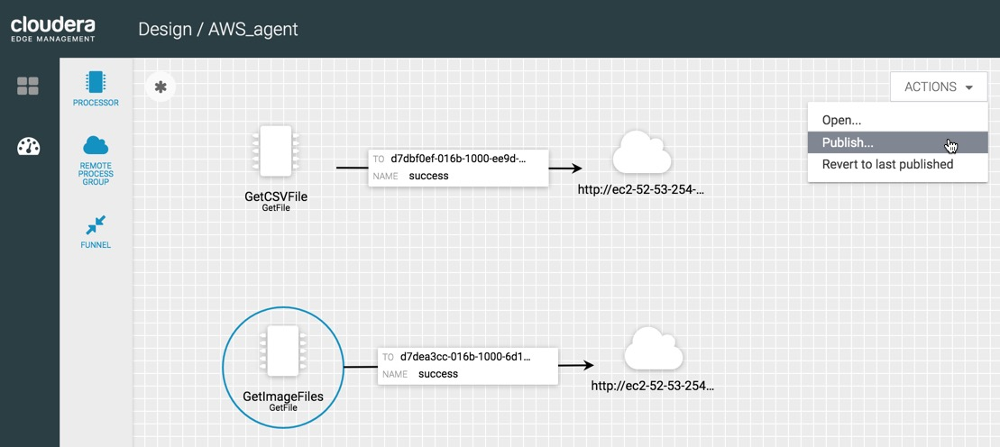

# Ingest Car Sensor Data on Edge

## Introduction

The variety of edge devices--whether it be IoT devices, Cloud VMs, or even containers--generating data in today's industry continues to diversify and can lead to data being lost. There is a need to author flows across all variety of edge devices running across an organization; further, there is a need to monitor the published across all devices without writing customized applications for all the different types of devices. CEM provides you with an interface to author flows and monitor them with ease. CEM is made up of a few components, namely Edge Flow Manager (EFM), and MiNifi. EFM provides you with a familiar user interface, similar to NiFi's, while MiNifi is used as the tool which helps you retrieve data from hard to reach places.

CEM also allows you to granularly deploy models to every different type of device in your enterprise

We will use Cloudera Edge Manager (CEM) to build a MiNiFi dataflow in the interactive UI and publish it to the MiNiFi agent running on the edge. This dataflow will ingest the car sensor data coming from ROS and push it to NiFi running in the cloud.

## Outline

- Tutorial 1: Ingest Car Sensor Data on Edge
- Tutorial 2: Collect Car Edge Data into Cloud
- Tutorial 3: Train CNN Model in Cloud
- Tutorial 4: Deploy CNN Model onto Car

## Prerequisites

- Deployed MiNiFi C++ agent on AWS EC2 Ubuntu 18.04 instance or Jetson TX2
    - AWS: t2.micro
- Deployed CEM on AWS EC2 instance
    - AWS: CentOS7 - with Updates HVM, t3.2xlarge, All traffic - all protocol - all ports - my IP
- Deployed CDH with CDSW enabled on AWS EC2 instance
    - Add private and public DNS of CEM EC2

## Install MiNiFi C++ on Edge

### EC2 Instance

SSH on to the machine assigned to be the agent:

~~~bash
ssh -i /path/to/pem_file <os-name>@<public-dns-ipv4>
~~~

Install MiNiFi C++:

~~~bash
# MiNiFi C++ for Ubuntu 18.04
wget http://mirrors.ibiblio.org/apache/nifi/nifi-minifi-cpp/0.6.0/nifi-minifi-cpp-bionic-0.6.0-bin.tar.gz

tar -xvf nifi-minifi-cpp-bionic-0.6.0-bin.tar.gz
~~~

Open your local terminal, we will transport updated minifi.properties file from our local machine to the ec2 instance:

~~~bash
wget -O ~/Downloads/minifi.properties https://raw.githubusercontent.com/james94/Autonomous-Car/master/documentation/assets/services/minifi_cpp/minifi.properties
scp -i ~/.ssh/jmedel-aws-iam.pem ~/Downloads/minifi.properties ubuntu@<ec2-public-dns>:/home/ubuntu/nifi-minifi-cpp-0.6.0/conf
~~~

Open your ec2 instance terminal:

~~~bash
vi $HOME/nifi-minifi-cpp-0.6.0/conf/minifi.properties
~~~

Enter your public host name in these fields

~~~bash
nifi.c2.agent.coap.host=<CEM Public DNS>

nifi.c2.flow.base.url=<CEM Public DNS>:10080/efm/api

nifi.c2.rest.url=<CEM Public DNS>:10080/efm/api/c2-protocol/heartbeat

nifi.c2.rest.url.ack=<CEM Public DNS>:10080/efm/api/c2-protocol/acknowledge
~~~

Download sample driving log data for MiNiFi:

~~~bash
sudo apt -y install unzip
mkdir -p /tmp/csdv/data/input/racetrack/
cd /tmp/csdv/data/input/racetrack/
wget https://github.com/james94/Autonomous-Car/raw/master/documentation/assets/data/image.tar.gz
tar -xvf image.tar.gz
~~~

Turn on agent:

~~~bash
cd nifi-minifi-cpp-0.6.0/bin
./minifi.sh start
~~~

## Build Data Flow for MiNiFi via CEM UI

The CEM events page will open:

Click on Flow Designer, you can click on the class associated with MiNiFi agent you want to build the dataflow for. 

> Note: Later when MiNiFi C++ agent deployed on separate the Jetson TX2, the class called **"CSDV_agent"** will appear.

For now click class **AWS_agent**. Press open to start building. The canvas opens for building flow for class **AWS_agent**:

We will build a MiNiFi ETL pipeline to ingest csv and image data.

### Add a GetFile for CSV Data Ingest

Add a **GetFile** processor onto canvas to get csv data:

Update processor name to **GetCSVFile**.

Double click on GetFile to configure. Scroll to **Properties**, add the properties in Table 1 to update GetFile's properties.

**Table 1:** Update **GetCSVFile** Properties

| Property  | Value  |
|:---|---:|
| `Input Directory`  | `/tmp/csdv/data/input/racetrack/image`  |
| `Keep Source File`  | `false`  |
| `Recurse Subdirectories` | `false` |

### Push CSV Data to Remote NiFi Instance

Add a **Remote Process Group** onto canvas to send csv data to NiFi remote instance:

Add URL NiFi is running on:

| Settings  | Value  |
|:---|---:|
| `URL` | `http://<ec2-public-DNS>:8080/nifi/` | 

Connect **GetCSVFile** to Remote Process Group, then add the NiFi destination input port ID you want to send the csv data:

| Settings  | Value  |
|:---|---:|
| `Destination Input Port ID` | `<NiFi-input-port-ID>` | 

> Note: you can find the input port ID by clicking on your input port in the NiFi flow. Make sure you connect to the input port that sends csv data to HDFS.

### Add a GetFile for Image Data Ingest

Add a **GetFile** processor onto canvas to get image data:

Update processor name to **GetImageFiles**.

Double click on GetFile to configure. Scroll to **Properties**, add the properties in Table 2 to update GetFile's properties.

**Table 2:** Update **GetFile** Properties

| Property  | Value  |
|:---|---:|
| `Input Directory`  | `/tmp/csdv/data/input/racetrack/image/logitech`  |
| `Keep Source File`  | `false`  |

### Push Image Data to Remote NiFi Instance

Add a **Remote Process Group** onto canvas to send image data to NiFi remote instance:

| Settings  | Value  |
|:---|---:|
| `URL` | `http://<ec2-public-DNS>:8080/nifi/` | 

Connect **GetImageFiles** to Remote Process Group, then add the following configuration:

| Settings  | Value  |
|:---|---:|
| `Destination Input Port ID` | `<NiFi-input-port-ID>` | 

> Note: you can find the input port ID by clicking on your input port in the NiFi flow. Make sure you connect to the input port that sends image data to HDFS.

### Publish Data Flow to MiNiFi Agent

Click on publish in actions dropdown:

Make this flow available to all agents associated with **AWS_agent** class, press publish:

> Note: you can add comment `Sending driving log csv and image data to NiFi`

Result of published successful:

